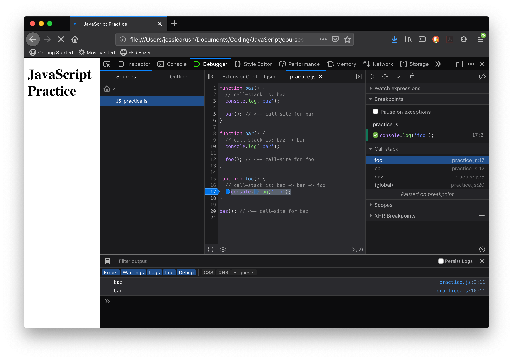
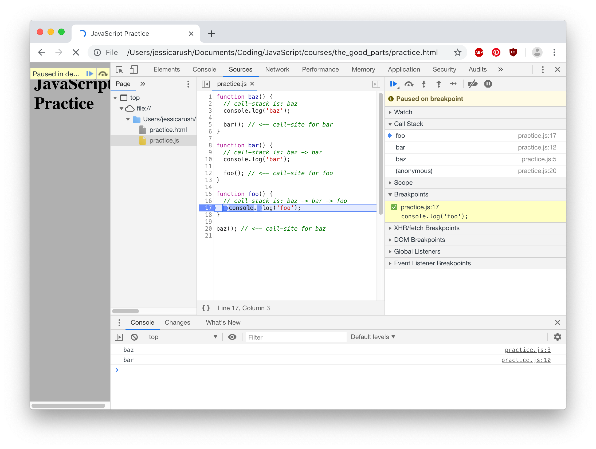

# Understanding the call-stack and call-site


Finding the call-site of a function can be helpful when determining things like `this` bindings. The call-stack is the current stack of functions that have been called to get to the current moment in execution. The following is a very basic demonstration of this:

```javascript
function baz() {
  // call-stack is: baz
  console.log('baz');

  bar(); // <-- call-site for bar
}

function bar() {
  // call-stack is: baz -> bar
  console.log('bar');

  foo(); // <-- call-site for foo
}

function foo() {
  // call-stack is: baz -> bar -> foo
  console.log('foo');
}

baz(); // <-- call-site for baz
```

The developer tools debugger can confirm the call-stack for us. If we were to drop a breakpoint at the first line in `foo()`, the debugger will show us the current call-stack when is pauses on this line. When looking at the stack, the second from the top will be the call-site.



